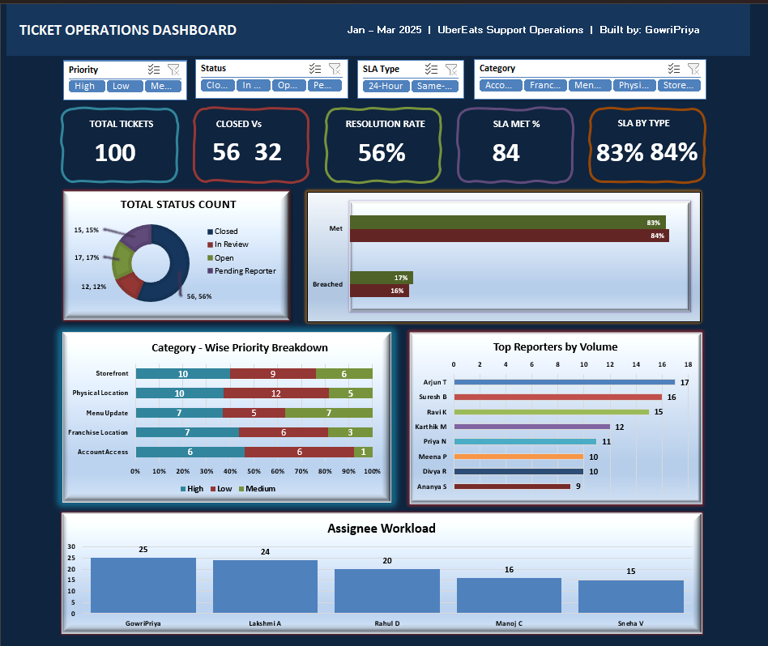

# Ticket Operations Dashboard — Excel

## 📊 Project Overview
An interactive Excel dashboard built from real-time 
Ticket operations data inspired by current job role 
at Uber Eats Support Operations.

## 🖼️ Dashboard Preview

## 📌 Key Features
- Dynamic Slicers filter all charts simultaneously
- KPI Cards — Total Tickets, Resolution Rate, SLA Met %
- 5 Chart Types — Doughnut, Stacked Bar, Horizontal Bar, 
  Column, Progress Bar
- Pivot Tables with live data connections

## 📈 Key Insights
- 100 tickets analysed (Jan – Mar 2025)
- 56% resolution rate
- SLA compliance tracked across Same-Day & 24-Hour types
- Agent workload comparison across 5 assignees

## 🛠️ Tools Used
Microsoft Excel | Pivot Tables | Slicers | 
COUNTIFS/COUNTIF | Dashboard Design | Data Visualization

## 👩‍💻 Built By
GowriPriya
